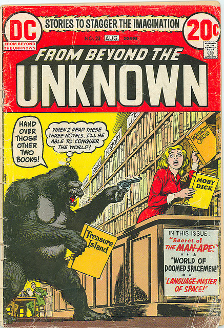

# Prolegomena

## Prolegomena

* Sorry, no ontology yet - this is work in progress.
* But a short lesson in data modeling does not harm.
* Feedback and contribution are welcome!

# Library data in the Semantic Web

## It’s been around for some time...

* Stefan Gradman (2004): rdfs:frbr - Towards an Implementation Model for Library
  Catalogs Using rdfs. *Cataloging Classification Quarterly* v39, n3/4, pp. 63-75
  <http://hdl.handle.net/10760/8021>.
* Ian Davis, Richard Newman, Bruce D’Arcus (2005): *Expression of Core FRBR Concepts 
  in RDF* <http://vocab.org/frbr/>.
* Talis, Talis, Talis.
* W3C (2011): Library Linked Data Incubator Group Final Report
  <http://www.w3.org/2005/Incubator/lld/XGR-lld/>.

## ...data is being published.

* BNB (bibliography): <http://bnb.data.bl.uk/>
* LIBRIS (bibliography, authority): <http://data.libris.kb.se/>
* DNB (bibliography, authority):
* Nature (bibliography): <http://data.nature.com/>
* VIAF (authority): <http://viaf.org/viaf/data/>
* LoC (authorities): <http://id.loc.gov/>
* Lobid (organizations): <http://lobid.org/>
* Europeana (authorities): <http://data.europeana.eu/>

* ...your library next at\
  <http://datahub.io/group/lld>

## What kind of library data?

* bibliographic data (title, author, date, stuff...)
* authority data (thesauri, classification, subjects...)
* organizations (to a very limited degree)

*Is this really the core stuff that libraries deal with day by day?*

## Questions you should be nervous about (look away)

* Where are the practical use cases?[^usecases]
* The data is often over-modeled *how it should be* instead of 
  how it actually is, isn’t it? (actually it is dirty)
* What about the data that makes libraries unique:

    * Not bibliographic data
    * Data about holdings, access, buildings, opening hours...

* What about **the patrons**?

[^usecases]: Apart from http://www.w3.org/2005/Incubator/lld/XGR-lld-usecase/

# Patron information

----

## Library patron information

Eventually it is not that much

* user profiles
* loans and reservations

## Why is patron information so neglected?

* Privacy: it is not Open Data
* Difficulties to get data out of legacy systems
* Lack of motivation?

## Motivation at GBV

* Access to library patron information in mobile apps and discovery interfaces
* Primarily an API
* Alignement with RDF only as by-product to facilitate reuse and to enforce
  quality management
* Same procedure as DAIA (API, data model & ontology)

## Existing ontologies

* BIBO, FRBR, RDA... (bibliographic data)
* FOAF (people)
* SIOC (online communities, access, services)
* DAIA (availability and library services, such as loan)
* ...
* OWL-S (discontinued Service Ontology, includes e.g. Shopping Cart)
* ...

## Data modeling rules of thumb (at least of my own thumbs) XXX

* RDFS and OWL are **not** conceptual modeling languages but
  schema languages, such as XSD, SQL Schema etc. Better don’t 
  begin with RDF at all.
* Begin with
  * Requirements: what information do we need?
  * Possibilites: what information do we have?
* Strip down to the least common denominator

* Begin with paper and pencil
* If it does not have an URI it does not exist

# Essential patron information

## Which patron information do we care about most?

* Personal data (name, email ...)
* Account data (state, type, expiration...)
* Loans and reservations

## Which patron information do we care about most?

* Personal data (name, email ...) **FOAF**
* Account data (state, type, expiration, fees...) **!?**
* Loans and reservations **!?**

## Account data

* `foaf:OnlineAccount` or `sioc:UserAccount`
* date of expiration (*no ontology found yet*)
* fees (*not ontology found yet*)
* account states and types
 
## Account states and types

The general state of of patron’s account in a library.

  0. active (may use most services)
  1. inactive (may not use most services)
  2. inactive because account expired
  3. inactive because of outstanding fees
  n. inactive because of ...

This does not involve types of accounts (e.g. student, professor, external user
etc.) because it’s difficult to find a consensus about account types among all
libraries. Such types may be mapped to `sioc:Role`.

## Account states in RDF

Many possible ontologies exist:

a) One class for each account state

        _:pa lib:hasPatronState [ a lib:PatronState ] .

b) Open world assumption with inactive as default

        lib:ActivePatron rdfs:subClassOf lib:Patron .

        _:pa a lib:Patron .         # could be active
        _:pa a lib:ActivePatron .   # active for sure 

c) Open world assumption with active as default

        _:pa lib:isInactiveBecause ?reason .

## Loans and reservations

= links between library patrons and documents held by libraries.

## Loans and reservations

Each loan or reservation is a (possibly n-ary) relation between document and patron. 

* Which patron
* Which document
* Current state
* Additional properties
  * Date issued
  * Number or renewals
  * Possibility to cancel and/or renew
  * Place to fulfill the request
  * ...

## Loans and reservations: which document?

* Patron might be interested in a specific work or edition
* Most loans are about a specific copy

## Loans and reservations: which document?

* Patron might be interested in a specific work or edition
* Most loans are about a specific copy

* Problem already addressed in DAIA ontology

      [ a bibo:Document ] daia:exemplar [ a frbr:Item ] .

* At least two URIs for each request:
  
    * URI of the patron originally requested
    * URI of the document the patron finally got
    

## Loans and reservations: 

## Document status

The current relation between a particular document and a particular patron.

0. no relation
1. reserved (the document is not accesible for the patron yet, but it will be)
2. ordered (the document is beeing made accesible for the patron)
3. held (the document is on loan by the patron)
4. provided (the document is ready to be used by the patron)
5. rejected (the document is not accesible at all)

## Result

We got an acronym!

**Patron Account Information API** (PAIA)

# Summary

...

# Appendix

## Sources

The current specification of Patron Account Information API (PAIA) is available
at <https://gbv.github.com/paia/>.

Source code and images of this presentation are available at
<https://github.com/jakobib/swib2012> under CC-BY-SA.

## Credits

Images from Wikimedia Commons:

* Paia beach looking east.jpg CC-BY-SA by Skier Dude

Fair use images:

* Nick Cardy: *Secret of the man-ape*. From beyond the unknown, issue 23, 1973
